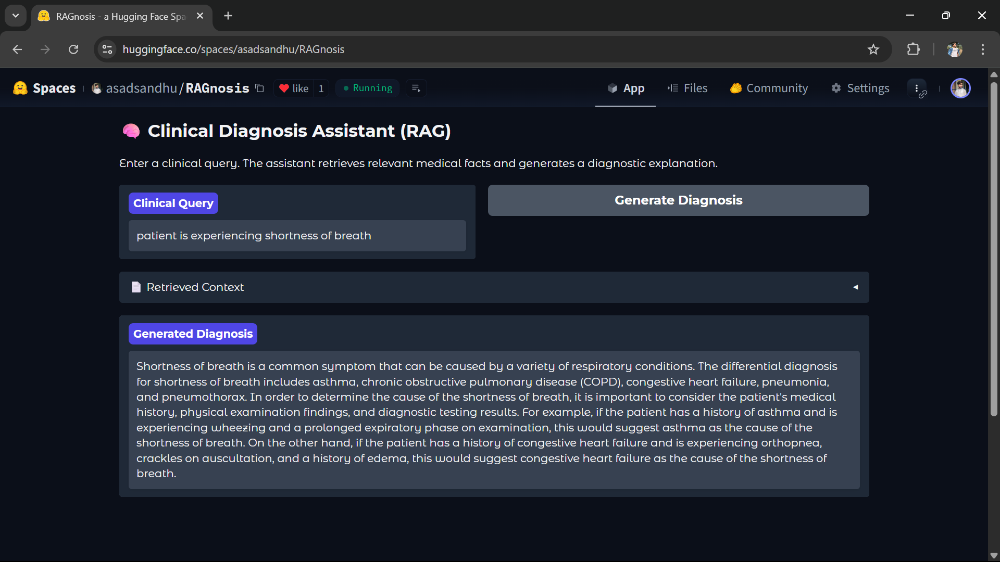

# 🩺 RAGnosis – Clinical Reasoning via Retrieval-Augmented Generation

[](LICENSE)
[](https://www.python.org/)
[](https://huggingface.co/spaces/asadsandhu/RAGnosis)
[](https://github.com/asadsandhu/RAG-Diagnostic-Assistant)

> ⚕️ A fully offline-capable, Gradio-powered RAG assistant trained on **annotated clinical notes** from the [MIMIC-IV-Ext-DiReCT](https://github.com/asadsandhu/RAG-Diagnostic-Assistant/blob/main/mimic-iv-ext-direct-1.0.0.zip) dataset to perform explainable diagnostic reasoning.

---

## 🖼️ Demo

Try it live on **Hugging Face Spaces** 👉  
🔗 https://huggingface.co/spaces/asadsandhu/RAGnosis

<p align="center">
  
</p>

---

## ⚙️ Tech Stack

| Layer        | Details                                                                 |
|--------------|-------------------------------------------------------------------------|
| 🧠 Model      | [`Nous-Hermes-2-Mistral-7B-DPO`](https://huggingface.co/NousResearch/Nous-Hermes-2-Mistral-7B-DPO) |
| 🏥 Dataset    | [`MIMIC-IV-Ext-DiReCT`](https://github.com/asadsandhu/RAG-Diagnostic-Assistant/blob/main/mimic-iv-ext-direct-1.0.0.zip) |
| 🔍 Retriever  | FAISS + SentenceTransformers (`all-MiniLM-L6-v2`)                      |
| 💻 Frontend   | Gradio (Hugging Face Spaces)                                            |
| 🧠 Backend    | PyTorch + Transformers + BitsAndBytes                                   |

---

## 🚀 Features

- 🔎 Top-k document retrieval from real annotated clinical notes
- 📋 Reasoning based on structured diagnostic chains
- 🧠 GPT-style generation from LLM (Mistral 7B) without internet dependency
- 🧾 Clean Gradio interface for natural medical queries
- 🧠 Answers explained like a clinical reasoning expert

---

## ⚡ Example Prompt

> *Patient presents with fatigue, orthopnea, and lower extremity edema.*

💬 **Model response:**
> Based on the patient's symptoms and context, the most likely diagnosis is **congestive heart failure (CHF)**...

---

## 🛠 How It Works

### ✅ Step 1: Preprocessing
- Extract chains from `samples/` and `diagnostic_kg/`
- Build retrievable clinical observations + diagnoses

### ✅ Step 2: Retrieval (FAISS)
- Embed notes using `MiniLM-L6-v2`
- Save as FAISS index → [`faiss_index.bin`](https://github.com/asadsandhu/RAG-Diagnostic-Assistant/blob/main/faiss_index.bin)  
- Paired with → [`retrieval_corpus.csv`](https://github.com/asadsandhu/RAG-Diagnostic-Assistant/blob/main/retrieval_corpus.csv)

### ✅ Step 3: Generation
- Format prompt in `[INST]` syntax
- Generate diagnosis using `Nous-Hermes-2-Mistral-7B-DPO`

---

## 🧪 Run Locally

```bash
# 1. Clone the repository
git clone https://github.com/asadsandhu/RAG-Diagnostic-Assistant.git
cd RAG-Diagnostic-Assistant

# 2. Install dependencies
pip install -r requirements.txt

# 3. Run the app
python app.py
````

✔️ Required files:

* [`retrieval_corpus.csv`](https://github.com/asadsandhu/RAG-Diagnostic-Assistant/blob/main/retrieval_corpus.csv)
* [`faiss_index.bin`](https://github.com/asadsandhu/RAG-Diagnostic-Assistant/blob/main/faiss_index.bin)

---

## 📁 Folder Structure

```
RAG-Diagnostic-Assistant/
├── app.py
├── faiss_index.bin
├── retrieval_corpus.csv
├── requirements.txt
├── assets/
│   └── demo.png
└── README.md
```

---

## 👤 Author

Built with ❤️ by **Asad Ali**
🔗 [LinkedIn – @asadsandhu0](https://www.linkedin.com/in/asadsandhu0)
🔗 [Hugging Face – RAGnosis](https://huggingface.co/spaces/asadsandhu/RAGnosis)

---

## 📄 License

This project is under the [MIT License](LICENSE).

---

## 🙏 Acknowledgments

* MIMIC-IV-Ext-DiReCT: Annotated diagnostic data
* Hugging Face Transformers + Gradio
* Facebook Research – FAISS
* Nous Research – Instruction-tuned Mistral model

---

> ⚠️ *Disclaimer: This project is for research/demo use only. Not intended for clinical decision-making.*
